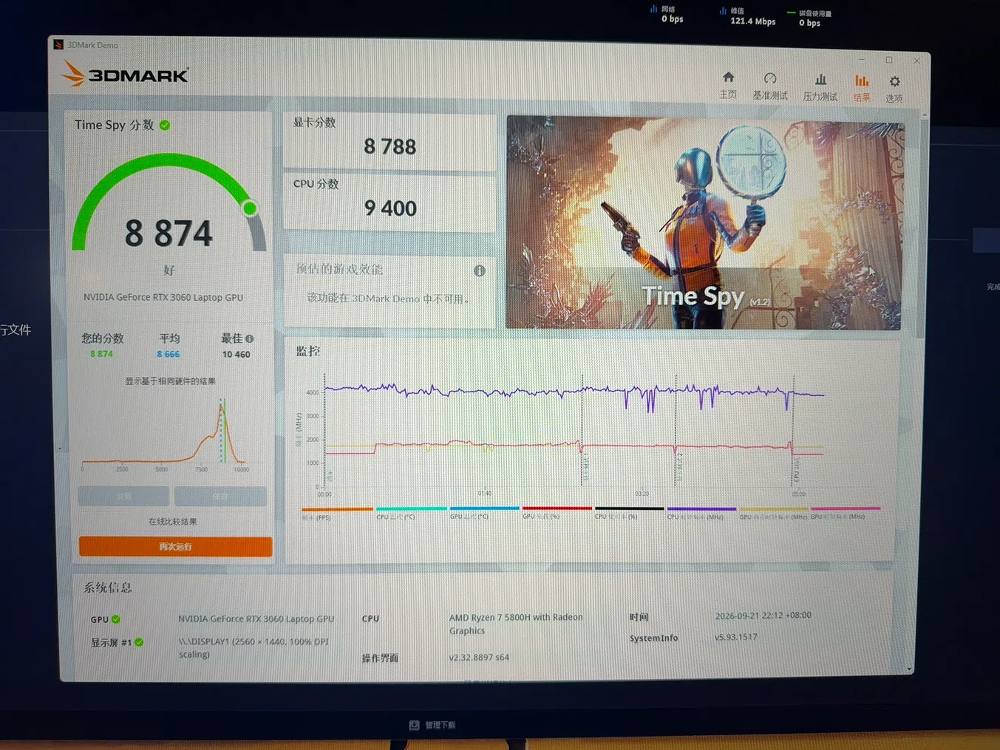
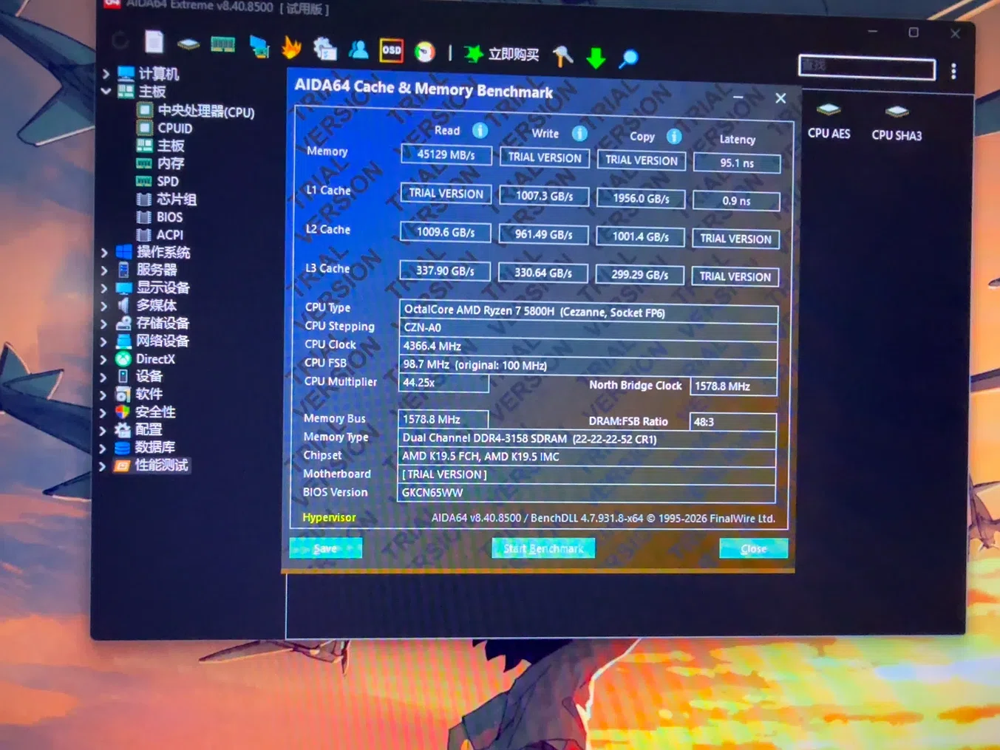
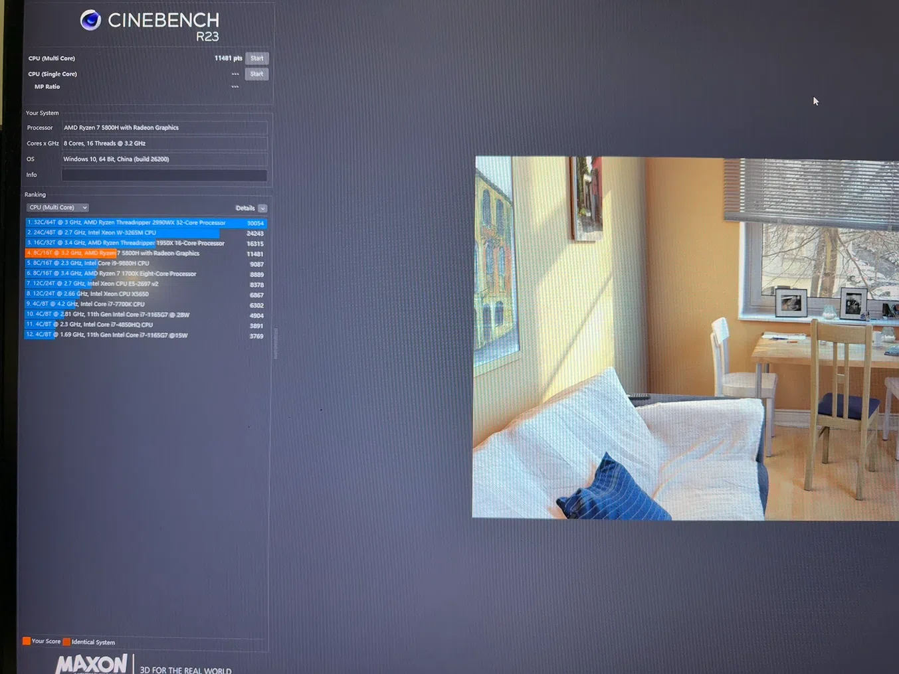

# 2021 R9000P

这台电脑是我2021年读研入学之后用给的学业奖学金购买的，当时售价7999元，购买后还剩1元。

## 基本配置

- 处理器：AMD 锐龙 7 5800H（8 核心 / 16 线程，3.2GHz 基准频率，最高加速频率 4.4GHz，16MB 三级缓存）
- 显卡：NVIDIA GeForce RTX 3060 Laptop GPU，6GB GDDR6 显存，130W 满血功耗
- 内存：三星16GB DDR4 3200MHz（8GB×2 双通道，双插槽设计）
- 硬盘：512GB M.2 PCIe NVMe 固态

其他的配置对于游戏来讲影响并不大，因为工作之后有工作电脑，这个笔记本就用来平常玩玩游戏，主要就是PUBG。

> 之所以喜欢PUBG，简单来讲就是觉得这个游戏能极大的锻炼自己的沟通指挥，以及发现那些潜在的人格差异。

## 使用情况

2021年购买一直到2024年这段读研期间，基本上就是轻度使用，因为需要搞毕业论文，找实习，找工作。
真正重度使用是从2024年6月份开始，工作之余开始PUBG。但是中途暂停了一段时间，因为2021.8.20【黑神话·悟空】发布，一直到2021.12月份，这个期间就一直在充当天命人(doge)。
差不多到了2024.12的时候第一次感觉到了电脑频繁掉帧，PUBG基本上不能玩了，体验很差。
然后2025.2月过完年回来清了一次灰，完了之后感觉好了很多，然后一直持续到了26年底。
再就是2026.8开始，又感觉到了频繁的掉帧，期间清了一次灰，换了新硅脂，但是并不起作用。

## 调整记录

2026.9.16左右购买了【玖和】的两条 16*2 3200MHz 的内存条，颗粒不清楚

> 换上之后效果不好，进PUBG掉帧极其严重，也有很丝滑的时候，不过整体体验下来还是差很多，于是退货。

与【玖和】一同买了一款散热支架，这款支架的效果还行，体感上摸起来感觉笔记本的B面没有那么烫手了，选择留下。
同时还买了 霍尼韦尔的相变片，据说效果不错，实际体验下来感触不是很深，也选择留下。

---

2026.9.19购买了【三星】的两条 16*2 3200MHz 的内存条，序列号结尾一个是B一个是D，应该隔了一个。

> 换上之后效果明显好了很多，在人多的时候或者视野变宽阔，渲染场景大的时候也能比较稳定，相较于之前有了很大的提升。

和三星内存条一起测试的还有：回退了N卡的驱动到 522.95 好像，因为之前是更新了英伟达9月份的新驱动，我感觉新驱动并不一定对30系的显卡有正向作用，很大程度上还是更适配50系显卡。

---

在折腾了这一圈之后，从网上下载了3个测试工具，分别测试了GPU、CPU、内存的情况。具体如下：

- GPU：
  - 测试软件：3DMark [直接在Steam商店搜索即可，下载安装之后运行]
  - 主要运行【Time Spy】这个测试项目，持续时间大概10分钟左右，主要是演示一段动画

> 结果分析：
>
> - **总分 8874**：评价是“好”。分数（绿字 8874）高于同配置的平均分（蓝字 8666），说明硬件状态比大多数同型号机器都要好。
> - **显卡分数 8788**：标准。我的 Time Spy 是在 2560×1440（2K） 分辨率下跑出来的，比一般 1080P 跑分低一点是正常的。8788 分说明 RTX 3060 处于满血释放状态，没有明显降频。
> - **CPU 分数 9400**：稍微偏低一点点（正常在 9500-10000 左右）。但这很正常，因为之前把“最大处理器状态”限制在了 99%，这会稍微压制一点 CPU 的爆发力。

---

- 内存：
  - 测试软件：AIDA64 [[https://www.aida64.com/downloads/archive](https://www.aida64.com/downloads/archive)]，有安装版[self-instaiiling] 和解压版 [ZIP]，两个都可以
  - 主要运行：顶部栏从左往右第3个【内存】栏目

> 结果分析： 
>
> - **双通道（Dual Channel）**：图里明确写着 Dual Channel，说明两根 16G 内存成功组成了双通道
> - **内存频率**：DDR4-3158 SDRAM。因为 AMD 平台的基准时钟（BCLK）会有微小波动，1578.8 MHz × 2 ≈ 3158 MHz。这和原来的 3200MHz 几乎没区别，属于完全正常的误差范围。
> - **读取速度**：45129 MB/s。对于 DDR4-3200 双通道来说，这个速度还行，说明内存带宽完全没问题。
> - **内存延迟(Latency)**：95.1ns：该款内存的时序是 CL22，理想状态下应该是在80以内，稍微偏高一点

---

- CPU：
  - 测试软件：Cinebench R23 [[https://www.maxon.net/en/downloads/cinebench-r23-downloads/](https://www.maxon.net/en/downloads/cinebench-r23-downloads/)]，下载后是一个ZIP，直接解压运行 [Cinebench.exe]
  - 主要运行软件左侧的 [CPU (Multi Core)]

> 结果分析：
>
> - **多核分数 11481**：R7 5800H 的正常多核分数范围大概在 11000-12000 之间。结果跑出 11481，属于**中上水平**。
> - **同级排名对比**：R7 5800H 在 Cinebench R23 里的平均分就在 11000 左右。分数比列表里那台 9880H 足足高了近 2400 分，说明CPU 性能释放非常彻底。
> - **温度控制成功**：之前**把“最大处理器状态”限制在 99%**，加上**霍尼韦尔 7950 相变片**，成功压住了这颗 5800H 的积热，因为你限制了 CPU 频率，分数依然能跑到 11481，说明 10 分钟的高负载下，**CPU 完全没有因为过热而触发降频**。

---

最终这款老机器R9000P依旧能再让我用个2~3年，后面如果内存价格下来再考虑换台式机器吧。